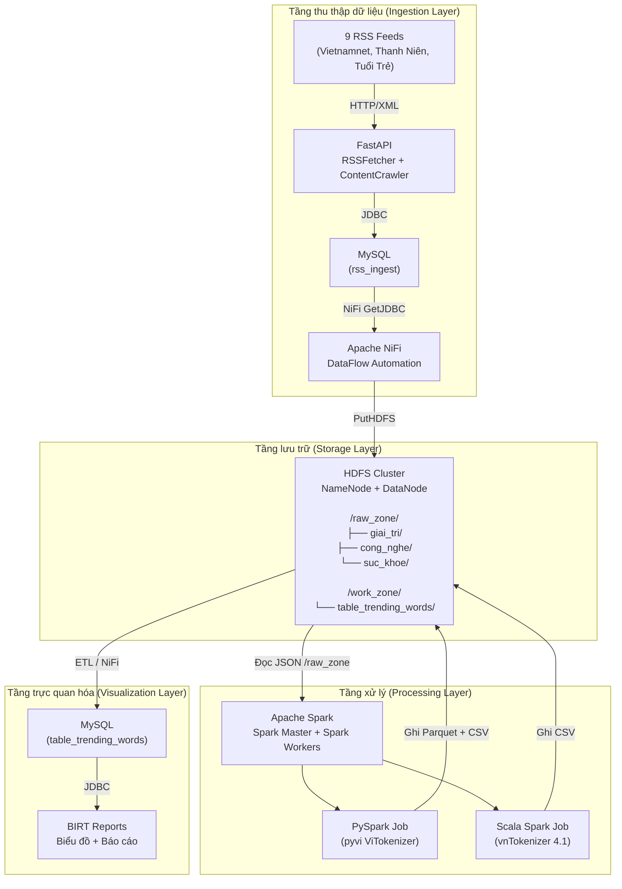

# Dữ liệu đầu vào và kiến trúc hệ thống

## 1. Dữ liệu đầu vào

### 1.1. Nguồn dữ liệu

Dữ liệu đầu vào của hệ thống được thu thập từ chín nguồn RSS của các trang báo điện tử Việt Nam, thuộc ba lĩnh vực khác nhau: Giải trí, Công nghệ và Sức khỏe. Mỗi lĩnh vực bao gồm ba nguồn tin tức, cụ thể là Vietnamnet, Thanh Niên và Tuổi Trẻ. Các luồng RSS (Really Simple Syndication) được hệ thống định kỳ truy vấn và phân tích để trích xuất thông tin bài viết.

### 1.2. Cấu trúc dữ liệu

Mỗi bài viết thu thập từ nguồn RSS bao gồm các trường thông tin cơ bản sau:

| Trường dữ liệu | Mô tả |
|---|---|
| `title` | Tiêu đề của bài viết |
| `link` | Đường dẫn URL đến bài viết gốc |
| `published` | Thời gian xuất bản (định dạng RFC 2822 hoặc ISO 8601) |
| `summary` | Tóm tắt nội dung bài viết |
| `source` | Tên nguồn tin (ví dụ: Vietnamnet, Thanh Niên, Tuổi Trẻ) |
| `category` | Lĩnh vực chủ đề (Giải trí, Công nghệ, Sức khỏe) |

Dữ liệu sau khi thu thập được xử lý sơ bộ qua các bước làm sạch HTML, chuẩn hóa tiêu đề, tạo slug và loại bỏ trùng lặp trước khi được lưu trữ vào cơ sở dữ liệu MySQL. Tiêu chí loại bỏ trùng lặp dựa trên sự kết hợp giữa tiêu đề đã chuẩn hóa, cùng ngày xuất bản và cùng nguồn tin.

Dữ liệu thô sau đó được xuất lên HDFS (Hadoop Distributed File System) tại vùng `/raw_zone` và được phân loại theo ba thư mục chuyên biệt: `giai_tri`, `cong_nghe` và `suc_khoe`. Mỗi bài viết được lưu trữ dưới định dạng JSON đa dòng (multi-line JSON) để phục vụ cho quá trình xử lý phân tán ở giai đoạn tiếp theo.

### 1.3. Cơ chế thu thập dữ liệu định kỳ

Quá trình thu thập dữ liệu được tự động hóa thông qua bộ lập lịch APScheduler (Advanced Python Scheduler) được tích hợp trong dịch vụ FastAPI. Bộ lập lịch này hoạt động như một cron job nội bộ, cho phép cấu hình tần suất thực thi thông qua biến môi trường `INGEST_INTERVAL_MINUTES` với giá trị mặc định là 30 phút.

Cơ chế hoạt động của bộ lập lịch được mô tả như sau:

- Khi dịch vụ FastAPI khởi động, bộ lập lịch APScheduler được khởi tạo và đăng ký một tác vụ định kỳ (scheduled job) với khoảng thời gian cấu hình trước.
- Tại mỗi chu kỳ thực thi, tác vụ duyệt qua chín nguồn RSS đang hoạt động được lưu trữ trong cơ sở dữ liệu MySQL.
- Với mỗi nguồn RSS, hệ thống thực hiện lần lượt các bước: truy vấn luồng RSS qua giao thức HTTP, phân tích cấu trúc XML/ RSS, trích xuất các bài viết mới, xử lý và làm sạch dữ liệu, kiểm tra trùng lặp và cuối cùng là lưu trữ vào cơ sở dữ liệu.
- Nhật ký thu thập (ingestion log) được ghi lại cho từng nguồn tin, bao gồm các thông tin: số lượng bài viết thu được, số lượng bài viết mới, số lượng bài viết trùng lặp và thời gian thực hiện.

Bên cạnh cơ chế lập lịch tự động, hệ thống cũng cung cấp API quản trị (Admin API) cho phép người vận hành chủ động khởi động hoặc dừng bộ lập lịch, cũng như thực hiện thu thập dữ liệu theo yêu cầu (on-demand) thông qua các điểm cuối HTTP (endpoints). Cơ chế này đảm bảo tính linh hoạt trong việc vận hành hệ thống, cho phép thích ứng với các nhu cầu thu thập dữ liệu khác nhau.

## 2. Mô hình kiến trúc hệ thống

Hệ thống được thiết kế theo mô hình kiến trúc phân tầng (layered architecture), bao gồm bốn tầng chức năng chính: tầng thu thập dữ liệu (Ingestion Layer), tầng lưu trữ (Storage Layer), tầng xử lý (Processing Layer) và tầng trực quan hóa (Visualization Layer). Mỗi tầng đảm nhận một vai trò độc lập và tương tác với các tầng khác thông qua các cơ chế giao tiếp chuẩn hóa.

## 3. Mô hình kiến trúc Big Data Platform

Nền tảng dữ liệu lớn (Big Data Platform) được xây dựng dựa trên mô hình kiến trúc Lambda với hai nhánh xử lý: xử lý theo lô (batch processing) và xử lý luồng (stream processing). Trong phạm vi nghiên cứu này, hệ thống tập trung vào nhánh xử lý theo lô với các thành phần chính sau đây.

```mermaid
graph LR
    subgraph "Tầng thu thập"
        A["Nguồn RSS<br/>(9 feeds)"]
        B["FastAPI<br/>RSS Ingestion Service"]
        C[("MySQL<br/>rss_ingest")]
    end

    subgraph "Tầng lưu trữ thô"
        D["Apache NiFi<br/>(JDBC → HDFS)"]
        E[("HDFS<br/>Raw Zone<br/>JSON")]
    end

    subgraph "Tầng xử lý"
        F["Apache Spark<br/>(PySpark / Scala)"]
        G["Xử lý NLP<br/>Tiếng Việt<br/>(Tokenization)"]
    end

    subgraph "Tầng lưu trữ kết quả"
        H[("HDFS<br/>Work Zone<br/>Parquet + CSV")]
        I[("MySQL<br/>table_trending_words")]
    end

    subgraph "Tầng trực quan hóa"
        J["BIRT<br/>Báo cáo & Biểu đồ"]
    end

    A -->|"Định kỳ 30 phút"| B
    B -->|"Lưu bài viết"| C
    C -->|"Xuất dữ liệu"| D
    D -->|"Ghi dạng JSON"| E
    E -->|"Spark Submit"| F
    F -->|"Phân tích từ khóa"| G
    G -->|"Kết quả"| H
    H -->|"ETL"| I
    I -->|"Truy vấn"| J
```

## 4. Sơ đồ tổng quan luồng dữ liệu (Data Pipeline)

Luồng dữ liệu của hệ thống được tổ chức theo một pipeline tuần tự với năm giai đoạn chính: Thu thập (Collection), Lưu trữ thô (Raw Storage), Xử lý (Processing), Lưu trữ kết quả (Result Storage) và Trực quan hóa (Visualization). Sơ đồ dưới đây mô tả chi tiết luồng di chuyển của dữ liệu qua từng giai đoạn.

```mermaid
flowchart LR
    subgraph G1["Thu thập"]
        direction TB
        RSS["RSS Feeds"]
        INGEST["FastAPI<br/>Ingestion Service"]
    end

    subgraph G2["Lưu trữ thô"]
        direction TB
        NIFI["Apache NiFi"]
        HDFS_RAW[("HDFS<br/>Raw Zone")]
    end

    subgraph G3["Xử lý"]
        direction TB
        SPARK_MASTER["Spark Master"]
        SPARK_WORKER1["Spark Worker 1"]
        SPARK_WORKER2["Spark Worker 2"]
        SPARK_MASTER --> SPARK_WORKER1
        SPARK_MASTER --> SPARK_WORKER2
    end

    subgraph G4["Lưu trữ kết quả"]
        direction TB
        HDFS_WORK[("HDFS<br/>Work Zone")]
        MYSQL_RESULT[("MySQL<br/>Trending Words")]
    end

    subgraph G5["Trực quan hóa"]
        direction TB
        BIRT["BIRT<br/>Reporting Engine"]
        REPORT(("Báo cáo<br/>Biểu đồ"))
    end

    RSS -->|"HTTP GET"| INGEST
    INGEST -->|"JDBC"| NIFI
    NIFI -->|"PutHDFS"| HDFS_RAW
    HDFS_RAW -->|"spark-submit"| SPARK_MASTER
    SPARK_WORKER1 -->|"Ghi kết quả"| HDFS_WORK
    SPARK_WORKER2 -->|"Ghi kết quả"| HDFS_WORK
    HDFS_WORK -->|"ETL"| MYSQL_RESULT
    MYSQL_RESULT -->|"JDBC"| BIRT
    BIRT --> REPORT
```

### 4.1. Giai đoạn Thu thập (Collection)

Dữ liệu được thu thập định kỳ thông qua dịch vụ FastAPI sử dụng thư viện APScheduler với tần suất cấu hình được (mặc định 30 phút/lần). Thành phần RSSFetcher thực hiện truy vấn đến các luồng RSS, phân tích cấu trúc XML và trích xuất thông tin bài viết. Thành phần ContentCrawler có tùy chọn truy cập sâu vào nội dung HTML của bài viết gốc nhằm thu thập dữ liệu văn bản đầy đủ.

### 4.2. Giai đoạn Lưu trữ thô (Raw Storage)

Apache NiFi đóng vai trò trung gian kết nối giữa cơ sở dữ liệu MySQL quan hệ và hệ thống tệp phân tán HDFS. Dữ liệu từ MySQL được truy xuất thông qua trình điều khiển JDBC và được ghi xuống HDFS dưới dạng tệp JSON tại vùng `/raw_zone`. Dữ liệu tại giai đoạn này được tổ chức theo cấu trúc thư mục phân loại theo chủ đề nhằm thuận tiện cho quá trình xử lý về sau.

### 4.3. Giai đoạn Xử lý (Processing)

Apache Spark thực hiện tác vụ xử lý phân tán trên dữ liệu đã lưu trữ tại HDFS. Hệ thống hỗ trợ hai phương án triển khai:

- **PySpark (Python):** Sử dụng thư viện pyvi ViTokenizer để tách từ tiếng Việt, kết hợp với bộ lọc từ dừng (stopwords). Kết quả được ghi xuống HDFS dưới định dạng Parquet và CSV.
- **Scala Spark:** Sử dụng thư viện vnTokenizer phiên bản 4.1.1 (Java/Scala) với mô hình bigram và từ điển DFA (Deterministic Finite Automaton) để nâng cao độ chính xác trong tách từ tiếng Việt.

Cả hai phương án đều thực hiện quy trình: đọc dữ liệu JSON từ ba thư mục chuyên biệt, làm sạch văn bản, tách từ, lọc từ dừng và tổng hợp tần suất xuất hiện của từ khóa theo các chiều thời gian, nguồn tin và chủ đề.

### 4.4. Giai đoạn Lưu trữ kết quả (Result Storage)

Kết quả xử lý từ Spark được lưu trữ đồng thời tại hai nơi: HDFS `/work_zone` dưới dạng tệp Parquet và CSV phục vụ cho các truy vấn phân tích trực tiếp, và cơ sở dữ liệu MySQL thông qua bảng `table_trending_words` với cấu trúc:

- `ngay`: Ngày thống kê (định dạng yyyyMMdd)
- `nguon`: Nguồn tin
- `chu_de`: Chủ đề
- `tu_khoa`: Từ khóa
- `so_lan_xuat_hien`: Số lần xuất hiện

### 4.5. Giai đoạn Trực quan hóa (Visualization)

BIRT (Business Intelligence and Reporting Tools) được sử dụng để kết nối với cơ sở dữ liệu MySQL và tạo các báo cáo trực quan. Các biểu đồ và bảng thống kê cho phép người dùng theo dõi xu hướng từ khóa theo thời gian, so sánh giữa các chủ đề và nguồn tin khác nhau, từ đó hỗ trợ quá trình ra quyết định dựa trên dữ liệu.

## 5. Các công nghệ sử dụng

Bảng dưới đây tổng hợp các công nghệ và phiên bản được sử dụng trong hệ thống:

| Công nghệ | Phiên bản | Vai trò |
|---|---|---|
| Apache Hadoop HDFS | 3.3.6 | Hệ thống tệp phân tán |
| Apache Spark | 3.5.0 | Xử lý dữ liệu phân tán |
| Apache NiFi | 1.25.0 | Tự động hóa luồng dữ liệu |
| Apache Airflow | 2.8.1 | Điều phối quy trình xử lý |
| FastAPI | 0.104.1 | Dịch vụ API thu thập dữ liệu |
| MySQL | 8.0 | Cơ sở dữ liệu quan hệ |
| PySpark | 3.5.0 | Xử lý Spark với Python |
| pyvi | - | Tách từ tiếng Việt (Python) |
| vnTokenizer | 4.1.1 | Tách từ tiếng Việt (Java/Scala) |
| BIRT | - | Công cụ báo cáo và trực quan hóa |
